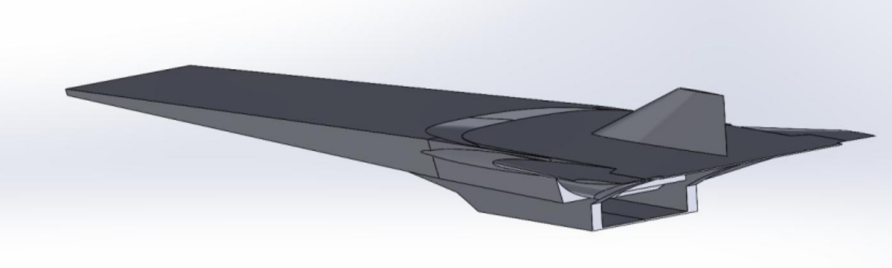
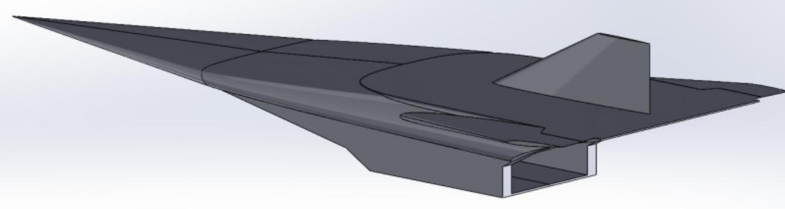
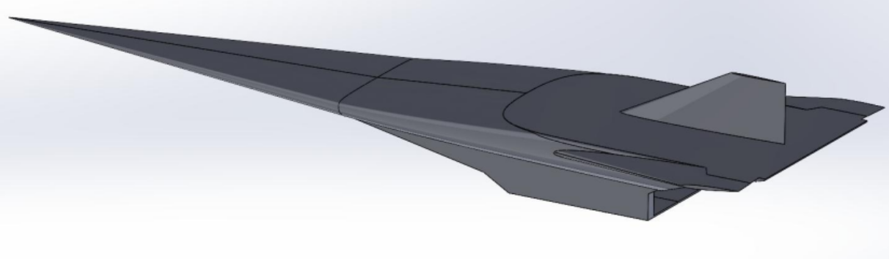
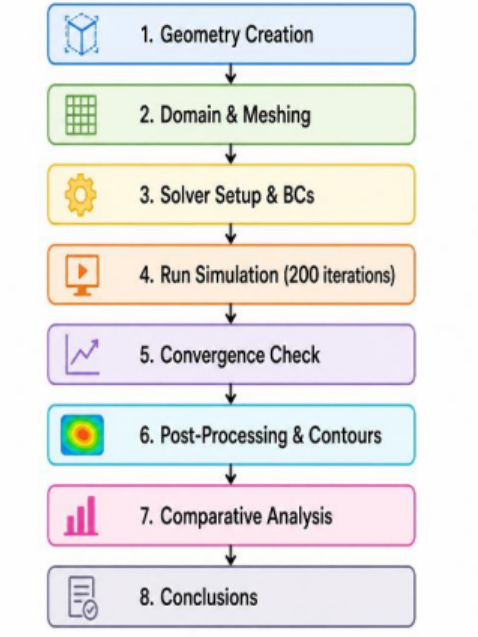
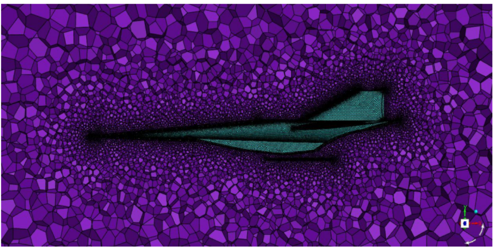
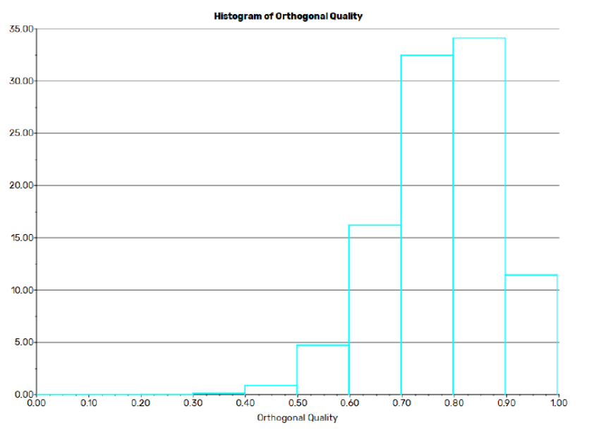
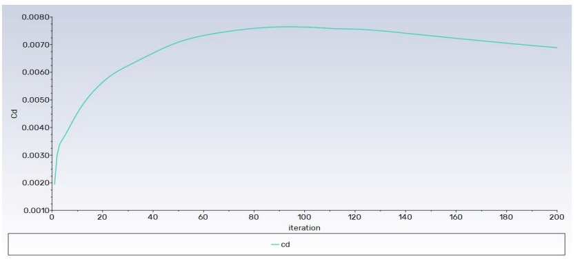
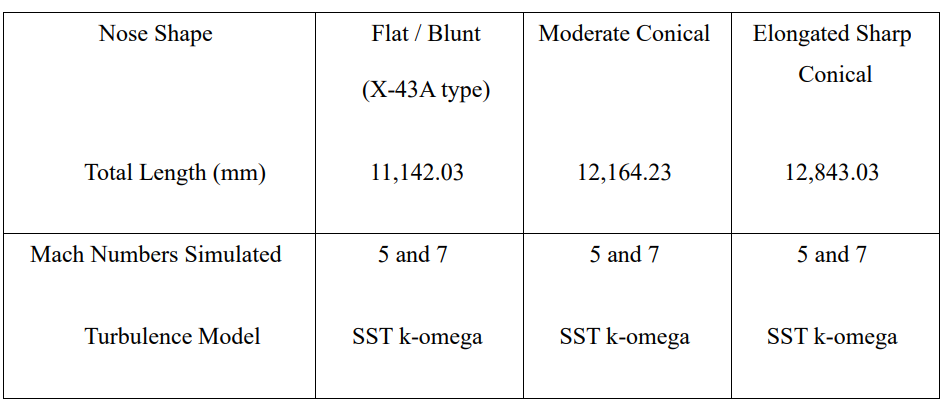

# 🚀 Aerodynamic Performance Analysis of Hypersonic Vehicles Using Computational Fluid Dynamics

## Project Overview

This project presents a three-dimensional Computational Fluid Dynamics (CFD) analysis of hypersonic vehicle configurations operating at **Mach 5** and **Mach 7** using **ANSYS Fluent 2024 R1**.

The study investigates the influence of nose geometry on aerodynamic performance by evaluating shock-wave formation, pressure distribution, temperature rise, density variation, and drag characteristics under hypersonic flight conditions. Three different nose configurations were analysed to determine their aerodynamic efficiency and flow behaviour.

---

## Objectives

* Investigate hypersonic flow characteristics around different vehicle geometries.
* Compare aerodynamic performance at Mach 5 and Mach 7.
* Analyze shock-wave formation and shock stand-off distance.
* Evaluate pressure, temperature, and density distributions.
* Assess the influence of nose geometry on aerodynamic drag and overall performance.

---

## Vehicle Configurations

Three hypersonic vehicle models were developed and analysed.

| Model       | Configuration                           |
| :---------- | :-------------------------------------- |
| **Model 1** | Flat / Blunt Nose (NASA X-43A Inspired) |
| **Model 2** | Moderate Conical Nose                   |
| **Model 3** | Elongated Sharp Conical Nose            |

### Vehicle Models

|       Model 1      |       Model 2      |       Model 3      |
| :----------------: | :----------------: | :----------------: |
|  |  |  |

---

## CFD Methodology

The numerical analysis followed a standard CFD workflow.

### Workflow

1. Geometry Development
2. Computational Domain Generation
3. Mesh Generation
4. Solver Configuration
5. Numerical Simulation
6. Convergence Assessment
7. Post Processing
8. Comparative Performance Analysis

---

## Simulation Parameters

| Parameter        | Specification                  |
| ---------------- | ------------------------------ |
| Software         | ANSYS Fluent 2024 R1           |
| Solver           | Density-Based Implicit         |
| Turbulence Model | SST k-ω                        |
| Working Fluid    | Air (Ideal Gas)                |
| Flow Regime      | Compressible Hypersonic Flow   |
| Analysis Type    | Three-Dimensional Steady-State |
| Mach Numbers     | 5 & 7                          |

---

## Mesh Generation

A high-quality unstructured computational mesh was generated to accurately capture shock-wave structures and boundary layer effects.

### Computational Mesh

### Mesh Statistics

* Approximately **4.14 Million Cells**
* Approximately **8.41 Million Faces**
* Approximately **756,000 Nodes**
* Local mesh refinement near the vehicle surface
* Mesh quality verification through orthogonal quality assessment

### Mesh Quality

---

## Engineering Analysis

The CFD simulations evaluated:

* Shock-wave structures
* Pressure distribution
* Temperature distribution
* Density variation
* Drag coefficient
* Lift coefficient
* Aerothermal characteristics
* Flow-field behaviour

---

## Results

### Drag Coefficient Convergence

### Comparative Vehicle Analysis

### Key Findings

* The blunt nose configuration generated a strong detached bow shock.
* Increasing nose sharpness reduced shock stand-off distance.
* The elongated conical configuration produced the lowest aerodynamic drag.
* Surface pressure and temperature increased significantly near the stagnation region.
* Nose geometry strongly influenced aerodynamic efficiency under hypersonic conditions.

---

## Software & Engineering Tools

* ANSYS Fluent 2024 R1
* ANSYS Meshing
* SolidWorks
* Microsoft Excel

---

## Skills Demonstrated

* Computational Fluid Dynamics (CFD)
* Hypersonic Aerodynamics
* Compressible Flow Analysis
* Numerical Simulation
* Mesh Generation
* Aerodynamic Performance Analysis
* Engineering Research
* Technical Documentation

---

## 📄 Technical Report

The complete project report is available in this repository.

📥 **Download the report here**

**[Hypersonic CFD Technical Report](report/hypersonic-cfd-report.pdf)**

---

## Future Scope

* Grid independence study
* Turbulence model comparison
* Thermal Protection System (TPS) evaluation
* Geometry optimisation for drag reduction
* High-temperature material analysis
* Higher Mach number investigations

---

## Contributors

* **Laxmipriya Murmu**
* Gowtham Kumar Talla
* Shaikh Mohd Zafar Iqbal Jawaid Ashraf
* Mounish Damera
* Jitesh Jambulkar

### Faculty Mentor

**Dr. Rahul Kumar**

---

> **Academic Project**
> Department of Aerospace Engineering
> Lovely Professional University
